# Mockly

**Cross-platform, multi-protocol mock server** — HTTP, WebSocket, gRPC, GraphQL, TCP, Redis, SMTP, MQTT, NATS, SNMP, DNS, AMQP, Kafka, LDAP, IMAP, FTP, Memcached, STOMP, CoAP, and SIP in a single binary with a built-in web UI, REST management API, scenario system, and fault injection.

[](https://github.com/dever-labs/mockly/actions/workflows/ci.yml)
[](https://github.com/dever-labs/mockly/releases/latest)
[](LICENSE)

---

## Table of contents

- [Features](#features)
- [Quickstart](#quickstart)
- [Configuration](#configuration)
- [Protocols](#protocols)
- [Component Testing](#component-testing)
- [Scenarios](#scenarios)
- [Fault Injection](#fault-injection)
- [PATCH Mocks](#patch-mocks)
- [Preset Configs](#preset-configs)
- [CLI Reference](#cli-reference)
- [Management API Reference](#management-api-reference)
- [Observability](#observability)
- [Client Libraries](#client-libraries)
  - [Testcontainers](#testcontainers)
- [CI Integration](#ci-integration)
- [Architecture](#architecture)
- [Development](#development)
- [Contributing](#contributing)
- [License](#license)

---

## Features

| Feature | Details |
|---|---|
| **Protocols** | HTTP, WebSocket, gRPC, GraphQL, TCP, Redis, SMTP, MQTT, NATS, SNMP, DNS, AMQP, Kafka, LDAP, IMAP, FTP, Memcached, STOMP, CoAP, SIP |
| **Request matching** | Method + path (exact / wildcard / named params / regex), headers (with `re:` pattern support), query params (exact / wildcard / regex / absence / repeated-value), JSON/multipart/XML body fields, authentication |
| **Response sequences** | Return a different response on each successive call — loop, hold last, or 404 when exhausted |
| **Response control** | Status code, headers, body, artificial delay |
| **Template responses** | Go template syntax in response bodies and headers (`{{now}}`, `{{.request.params.id}}`, `{{.request.body.foo}}`, etc.) |
| **State conditions** | Fire a mock only when a runtime state variable matches |
| **Scenarios** | Named sets of mock patches — activate/deactivate atomically via API or CLI |
| **Per-protocol fault injection** | Each protocol exposes its own native fault fields (DNS rcode, gRPC status code, Kafka error code, etc.) — activate via API or bundled inside a scenario |
| **Per-mock fault injection** | Fault fields on individual HTTP mocks with independent delay (fixed or jittered range), status/body override, error rate, and rate limiting |
| **Call verification** | Track how many times each mock was hit; block until an expected count is reached |
| **Record mode (HTTP)** | Proxy unmatched requests to a real upstream, relay the real response, and capture it as a new mock for instant replay — bootstrap a mock set without hand-authoring every response |
| **Outbound webhooks** | Any HTTP mock can fire a templated outbound callback (server-initiated notification) when matched — with delay, retries, and a searchable attempt history |
| **Log filtering** | Filter logs and log counts by matched mock ID via `/api/logs` and `/api/logs/count` |
| **PATCH mocks** | Change only specific response fields at runtime without replacing the whole mock |
| **Preset configs** | Drop-in YAML configs for Keycloak, Authelia, OAuth2, GitHub, Stripe, OpenAI, Slack, Twilio, SendGrid, Anthropic, Resend, PagerDuty, AWS S3, NTLM, Nets/Nexi |
| **Spec-driven mock generation** | `mockly generate <spec>` turns an OpenAPI 3.x document, an AsyncAPI 2.x/3.x document, or a Protobuf (`.proto`) service definition into a ready-to-run config, auto-detecting which it is — or reference the spec directly from `mockly.yaml` (`openapi:`/`asyncapi:`/`proto:`) to keep regenerating it live and layer hand-written mocks on top |
| **Web UI** | Served from the binary itself — no separate install |
| **Management API** | 60+ REST endpoints covering all protocols, scenarios, fault, state, logs, webhooks, and call counts |
| **Live request log** | SSE-streamed in real time to the UI |
| **Observability** | Opt-in Prometheus `/metrics` endpoint — request-rate, latency histograms, and active-mock count |
| **CI-friendly** | Zero dependencies, single binary, YAML config, Docker image |

---

## Quickstart

### Download

Grab the binary for your platform from the [releases page](https://github.com/dever-labs/mockly/releases), or build from source:

```sh
git clone https://github.com/dever-labs/mockly
cd mockly
make build        # builds UI + Go binary
```

### Run with a config file

```sh
mockly start --config mockly.yaml
```

Open `http://localhost:9091` for the web UI, or call the management API at the same port.

### Run a preset

```sh
mockly preset use keycloak    # starts Mockly pre-loaded with Keycloak endpoints
mockly preset list            # list all available presets
mockly preset show stripe     # print the preset YAML
```

---

## Configuration

Mockly is driven by a YAML config file. Every section is optional.

```yaml
mockly:
  api:
    port: 9091   # Management API + Web UI port (default: 9091)
    # cors:      # CORS for the management API. Defaults to wide-open ("*").
    #   enabled: true                          # Set false to disable CORS headers entirely
    #   allowed_origins: ["http://localhost:3000"]
    #   allowed_methods: ["GET","POST","PUT","DELETE","OPTIONS"]
    #   allowed_headers: ["Content-Type","Authorization"]

protocols:
  http:
    enabled: true
    port: 8080
    # max_body_bytes: 10485760  # Request body size limit in bytes (0 = unlimited, default)
    mocks:
      - id: list-users
        request:
          method: GET
          path: /api/users
        response:
          status: 200
          headers:
            Content-Type: application/json
          body: '[{"id":1,"name":"Alice"}]'
          delay: 50ms

  websocket:
    enabled: true
    port: 8081
    mocks:
      - id: echo
        path: /ws/echo
        on_message:
          - match: ping
            respond: pong

  grpc:
    enabled: true
    port: 50051
    services:
      - mocks:
          - id: get-user
            method: GetUser
            response:
              id: "1"
              name: Alice

  graphql:
    enabled: true
    port: 8082
    path: /graphql
    mocks:
      - id: get-user
        operation_type: query
        operation_name: GetUser
        response:
          user:
            id: "1"
            name: Alice

  tcp:
    enabled: true
    port: 8083
    mocks:
      - id: hello
        match: "HELLO"
        response: "WORLD\n"

  redis:
    enabled: true
    port: 6379
    mocks:
      - id: get-session
        command: GET
        key: "session:*"
        response:
          type: bulk
          value: '{"userId":"abc"}'

  smtp:
    enabled: true
    port: 2525
    domain: mockly.local
    rules:
      - id: accept-all
        action: accept

  mqtt:
    enabled: true
    port: 1883
    mocks:
      - id: sensor-ack
        topic: "sensors/+"
        response:
          topic: "sensors/ack"
          payload: '{"ok":true}'

scenarios:
  - id: auth-down
    name: Auth Service Down
    description: Simulate auth outage — all token endpoints return 503
    patches:
      - mock_id: list-users
        status: 503
        body: '{"error":"auth unavailable"}'
```

### Path matching

| Pattern | Matches |
|---|---|
| `/api/users` | Exact match |
| `/api/*` | Any path starting with `/api/` (trailing wildcard) |
| `/regions/*/emails` | Any single segment in the middle — e.g. `/regions/fr-par/emails` |
| `/users/{id}` | Named segment — value captured as `{id}` in templates and logs |
| `/orders/{id}/items/{item}` | Multiple named segments |
| `re:^/users/\d+$` | Inline regex with `re:` prefix |

Use `path_regex` when you prefer a dedicated regex field instead of the inline `re:` prefix on `path`:

```yaml
request:
  method: GET
  path_regex: "^/users/\\d+$"   # alternative to re: prefix
```

### Template responses

Response bodies **and response headers** are rendered as Go templates. Built-in functions:

| Function | Example | Description |
|---|---|---|
| `{{now}}` | `2024-01-15T10:30:00Z` | Current UTC time (RFC3339) |
| `{{date "2006-01-02"}}` | `2024-01-15` | Current date in Go format |
| `{{date_add "2006-01-02" "-7d"}}` | `2024-01-08` | Date with duration offset |
| `{{uuid}}` | `550e8400-e29b-41d4-a716-446655440000` | Random UUID v4 |
| `{{rand_int 1 100}}` | `42` | Random integer in [min, max] |
| `{{rand_float 0.0 1.0 2}}` | `0.73` | Random float with N decimal places |
| `{{rand_string 8}}` | `aB3xKp7m` | Random alphanumeric string |
| `{{rand_string 8 "hex"}}` | `3f9a1c2b` | Charset: `alpha`, `lower`, `upper`, `numeric`, `hex`, `alphanumeric`, or custom |
| `{{rand_bool}}` | `true` | Random boolean |
| `{{pick "a" "b" "c"}}` | `b` | Randomly pick one of the given values |
| `{{fake "name"}}` | `Alice Smith` | Fake full name |
| `{{fake "email"}}` | `alice.smith@example.com` | Fake email |
| `{{fake "phone"}}` | `+1-555-0142` | Fake phone number |
| `{{fake "company"}}` | `Apex Labs` | Fake company name |
| `{{fake "city"}}` | `Berlin` | Fake city |
| `{{fake "country"}}` | `Germany` | Fake country |
| `{{fake "street"}}` | `42 Main St` | Fake street address |
| `{{fake "zip"}}` | `10115` | Fake postal code |
| `{{fake "ip"}}` | `192.168.1.42` | Fake IPv4 |
| `{{fake "ipv6"}}` | `2001:db8::1a2b:3c4d` | Fake IPv6 |
| `{{fake "url"}}` | `https://apex.io/api/lorem` | Fake URL |
| `{{fake "username"}}` | `alice42` | Fake username |
| `{{fake "useragent"}}` | `Mozilla/5.0 …` | Random User-Agent string |
| `{{fake "word"}}` | `lorem` | Single lorem ipsum word |
| `{{fake "sentence"}}` | `lorem ipsum dolor sit amet` | Short lorem ipsum phrase |
| `{{seq "counter"}}` | `1`, `2`, `3`, … | Auto-incrementing integer per named counter |
| `{{lorem 5}}` | `lorem ipsum dolor sit amet` | N lorem ipsum words |
| `{{upper "hello"}}` | `HELLO` | Uppercase string |
| `{{lower "WORLD"}}` | `world` | Lowercase string |
| `{{.body}}` | *(request body)* | Incoming request body |
| `{{.headers.X-Foo}}` | *(header value)* | Incoming request header |
| `{{.query.foo}}` | *(query value)* | Incoming request query parameter |
| `{{state "key"}}` | *(state value)* | Value from runtime state store |

#### Request context

In addition to the legacy shorthand aliases above, templates expose a `request.*` namespace:

| Variable | Example | Description |
|---|---|---|
| `{{.request.method}}` | `POST` | HTTP method of the incoming request |
| `{{.request.path}}` | `/users/42` | Request path |
| `{{.request.params.id}}` | `42` | Named path parameter captured by `{id}` |
| `{{.request.query.foo}}` | `bar` | Query parameter (alias: `{{.query.foo}}` still works) |
| `{{.request.headers.X-Foo}}` | `…` | Request header (alias: `{{.headers.X-Foo}}` still works) |
| `{{.request.body.field}}` | `…` | JSON field from request body (alias: `{{.body}}` for raw body still works) |

**Sequence counters** (`{{seq "name"}}`) are reset to zero by `POST /api/reset` or `mockly reset`.

Example — echo request fields in a create-style API:

```yaml
- id: create-email
  request:
    method: POST
    path: /transactional-email/v1alpha1/regions/{region}/emails
  response:
    status: 200
    body: |
      {
        "id": "{{uuid}}",
        "region": "{{.request.params.region}}",
        "project_id": "{{.request.body.project_id}}",
        "created_at": "{{now}}"
      }
```

Example — generate a realistic user object on every request:

```yaml
response:
  status: 200
  headers:
    Content-Type: application/json
  body: |
    {
      "id": "{{uuid}}",
      "name": "{{fake "name"}}",
      "email": "{{fake "email"}}",
      "role": "{{pick "user" "admin" "viewer"}}",
      "score": {{rand_float 0 100 1}},
      "created_at": "{{now}}"
    }
```

---

### Variables and environment substitution

Config files support `${NAME}` and `${NAME:-default}` references, expanded
before the file is parsed as YAML. A reference is resolved in this order:

1. An OS environment variable named `NAME`, if set.
2. An entry named `NAME` in the config's own top-level `vars:` map.
3. The inline `:-default` fallback, if present.
4. Otherwise, config loading fails with an error listing every missing name.

Environment variables keep secrets and per-environment values (signing
keys, ports, hostnames) out of a config file that might be committed to
source control. The `vars:` map lets a config (or a preset you're sharing)
define its own committable defaults in one place instead of repeating the
same literal value throughout the file — and those defaults can still be
overridden at runtime via an OS environment variable of the same name,
without editing the file:

```yaml
vars:
  realm: myrealm
  issuer: http://localhost:8080

protocols:
  http:
    enabled: true
    port: ${MOCKLY_HTTP_PORT:-8080}
    mocks:
      - id: webhook
        request: { method: POST, path: /webhook }
        response:
          status: 200
          headers:
            X-Signature: "${WEBHOOK_SIGNING_KEY}"
      - id: realm-info
        request: { method: GET, path: "/realms/${realm}" }
        response: { status: 200, body: "{\"issuer\": \"${issuer}/realms/${realm}\"}" }
```

- `${NAME}` — replaced with the env var or `vars:` entry. If neither
  exists, config loading fails with an error listing every missing name.
- `${NAME:-default}` — replaced with the env var or `vars:` entry if either
  exists, otherwise the literal `default` (which may be empty: `${NAME:-}`).
- `vars:` entries are plain string values — they are not themselves
  further expanded (no recursive `${...}` resolution inside a `vars:`
  entry's value).

---

## Protocols

### HTTP

Full HTTP mock server. Matching on method + path (exact/wildcard/named params/regex), optional query params, header match (with `re:` / `*` pattern support), JSON/multipart/XML body field match, authentication, and state condition.

```yaml
protocols:
  http:
    enabled: true
    port: 8080
    max_body_bytes: 10485760  # optional: limit request body size (bytes); 0 = unlimited (default)
    mocks:
      - id: create-user
        request:
          method: POST
          path: /users
          headers:
            Authorization: "Bearer *"
        response:
          status: 201
          body: '{"id":"{{uuid}}"}'
          headers:
            Content-Type: application/json
          delay: 20ms
```

#### Query parameter matching

```yaml
      - id: admin-users
        request:
          method: GET
          path: /users
          query:
            role: admin              # exact match
            page: "*"                # any value (wildcard)
            order_id: 're:^ORD-\d+$' # regex match ("re:" prefix)
            debug: "!present"        # asserts the param must be ABSENT
        response:
          status: 200
          body: '[{"id":1,"role":"admin"}]'
```

When a query param is repeated (e.g. `?tag=a&tag=b`), a match succeeds if
**any** occurrence satisfies the configured value/pattern.

#### JSON body field matching

Use dot-notation paths to match fields anywhere in a JSON body:

```yaml
      - id: gbp-payment
        request:
          method: POST
          path: /payments
          body_json:
            currency: GBP        # exact
            "user.tier": premium # nested: {"user":{"tier":"premium"}}
            "items.0.sku": "*"   # any SKU (wildcard)
        response:
          status: 200
          body: '{"ok":true}'
```

#### Multipart and XML body field matching

For `multipart/form-data` requests (e.g. file uploads), `body_multipart`
matches individual form fields by name. Text fields are matched by value;
file parts are matched via `<field>.filename`/`<field>.content_type`:

```yaml
      - id: avatar-upload
        request:
          method: POST
          path: /profile/avatar
          body_multipart:
            "name": "Alice"              # text field, exact match
            "avatar.filename": "*"       # asserts a file was uploaded
            "avatar.content_type": "image/png"
        response:
          status: 200
          body: '{"ok":true}'
```

For XML bodies (SOAP, legacy enterprise APIs), `body_xml` matches
element text and attributes using the same dot-notation style as
`body_json`; a leading `@` segment matches an attribute instead of
descending into a child element:

```yaml
      - id: soap-login
        request:
          method: POST
          path: /soap
          body_xml:
            "user.role": admin     # <user><role>admin</role></user>
            "user.@id": "*"        # <user id="...">
        response:
          status: 200
          body: '<ok/>'
```

#### Response sequences

Return a different response on each successive call. Useful for simulating transient errors or pagination.

```yaml
      - id: flaky-service
        request:
          method: GET
          path: /data
        sequence:
          - status: 503
            body: '{"error":"unavailable"}'
          - status: 503
            body: '{"error":"unavailable"}'
          - status: 200
            body: '{"data":"ok"}'
        sequence_exhausted: hold_last   # hold_last (default) | loop | not_found
        response:
          status: 200
          body: '{"data":"ok"}'
```

| `sequence_exhausted` | Behaviour after all entries are consumed |
|---|---|
| `hold_last` | Keep returning the last entry (default) |
| `loop` | Restart from the first entry |
| `not_found` | Return 404 |

#### Streaming responses (SSE / chunked)

Set `response.stream.events` to turn a mock into a sequence of flushed
events instead of one static body — for Server-Sent Events
(`text/event-stream`) or plain chunked/flushed streaming. Each event's
`data` is rendered as a template (same `{{ }}` syntax as `body`), and its
optional `delay` is slept before that event is written and flushed.

```yaml
      - id: chat-stream
        request:
          method: POST
          path: /v1/chat/completions
        response:
          status: 200
          headers:
            Content-Type: text/event-stream
          stream:
            events:
              - data: '{"chunk":"Hello"}'
                delay: 100ms
              - data: '{"chunk":" world"}'
                delay: 100ms
              - data: "[DONE]"
```

When `Content-Type` contains `text/event-stream`, each event is framed as
an SSE message: optional `event:`/`id:` lines, one `data:` line per line
of `data` (multi-line payloads are supported per the SSE spec), then a
blank line. Without that content type, `data` is written and flushed
as-is — no SSE framing — for plain chunked streaming.

`stream` is not combined with `sequence`, scenario patches, or fault
injection: if any of those fire for a given call, that call falls back to
a normal static response instead of streaming.

#### Per-mock fault injection

Every HTTP mock can have its own `fault:` block — independently of protocol-level faults. This is useful for targeted latency tests or intermittent failures on one endpoint without affecting the rest of the protocol server.

```yaml
      - id: slow-search
        request:
          method: GET
          path: /search
        fault:
          delay: 2s       # add latency
          error_rate: 0.5 # only apply 50% of the time (0 = always)
        response:
          status: 200
          body: '[]'
```

Instead of (or in addition to) a fixed `delay`, use `delay_range` for a
uniform-random jittered delay per request — more realistic than one constant
value for testing timeout/retry/loading-state handling:

```yaml
        fault:
          delay_range:
            min: 150ms
            max: 400ms
```

Use `rate_limit` to simulate a throttled API: once more than
`requests_per_second` requests are observed in the trailing one-second
window, `over_limit_status` (default 429) is returned instead of the normal
response. Each mock with a `rate_limit` fault tracks its own independent
window.

```yaml
        fault:
          rate_limit:
            requests_per_second: 5
            over_limit_status: 429     # default 429
            body: '{"error":"rate limit exceeded"}'
```

#### Near-miss diagnostics for unmatched requests

By default, a request that matches no mock returns a plain
`{"error":"no mock matched"}` (404) — this never changes for normal
client traffic. To debug *why* a request didn't hit the mock you
expected, opt in with `?debug=true` or an `X-Mockly-Debug: true` header:

```bash
curl "http://localhost:8080/orders?order_id=bad-id&debug=true"
```

```json
{
  "error": "no mock matched",
  "near_misses": [
    { "mock_id": "get-order", "reason": "query \"order_id\" value(s) [bad-id] did not match \"re:^ORD-\\d+$\"" }
  ]
}
```

Up to 3 of the closest candidates are reported (mocks that passed the
most checks — method, path, headers, query, body, `body_json`,
`body_multipart`, `body_xml`, state, auth — before failing), ranked
closest-first. Near-miss info is also
included in the mock's request log entry whenever diagnostics were
requested, so it shows up in the management UI's live log stream too.

#### Authentication matching

Use the `auth:` block to require valid credentials before a mock is considered a match. When auth fails the mock is skipped — add a fallback mock (without `auth`) to return your preferred 401 response.

Header values everywhere also support `re:` regex patterns and `*` wildcard, making it easy to match any bearer token without an `auth:` block if you prefer.

**Bearer token**

```yaml
      - id: secure-endpoint
        request:
          method: GET
          path: /api/data
          auth:
            type: bearer
            token: "my-secret-token"  # exact | "re:^ey[A-Za-z0-9]" regex | "*" (any token)
        response:
          status: 200
          body: '{"data":"sensitive"}'

      - id: secure-endpoint-unauth        # fallback for missing/wrong token
        request:
          method: GET
          path: /api/data
        response:
          status: 401
          headers:
            WWW-Authenticate: 'Bearer realm="api"'
          body: '{"error":"unauthorized"}'
```

**Basic auth**

```yaml
      - id: admin-page
        request:
          method: GET
          path: /admin
          auth:
            type: basic
            username: admin
            password: s3cret     # Mockly decodes the Base64 header internally
        response:
          status: 200
```

**API key** (header or query parameter)

```yaml
      - id: weather
        request:
          method: GET
          path: /weather
          auth:
            type: api_key
            header: X-API-Key    # or: query: api_key
            value: "key-abc123"  # exact | "re:…" | "*"
        response:
          status: 200
```

**NTLM** (Windows-integrated auth)

Mockly drives the full 3-step NTLM challenge/response handshake automatically. Any well-formed token sequence is accepted — no credential validation.

```yaml
      - id: windows-endpoint
        request:
          method: GET
          path: /api/windows
          auth:
            type: ntlm
        response:
          status: 200
          body: '{"authenticated":true}'
```

The handshake sequence:
1. No `Authorization` header → `401 Unauthorized` + `WWW-Authenticate: NTLM`
2. `Authorization: NTLM <type-1 Negotiate>` → `401 Unauthorized` + `WWW-Authenticate: NTLM <type-2 Challenge>`
3. `Authorization: NTLM <type-3 Authenticate>` → mock's configured response

See `configs/presets/ntlm.yaml` for a complete working example.

**Digest**

Requires an `Authorization: Digest …` header to be present (no nonce validation):

```yaml
          auth:
            type: digest
```

### Outbound Webhooks

Any HTTP mock can fire a templated outbound HTTP callback when it's matched
— simulating systems that notify clients asynchronously via server-initiated
requests (payment gateway callbacks, job-completion notifications, message
broker pushes, etc.) rather than only responding synchronously.

Dispatch is fire-and-forget: the callback is sent in the background and
never blocks or delays the mock's own HTTP response. `url`, `headers`, and
`body` all support the same Go template syntax as response bodies, so the
callback target and payload can be derived from the triggering request
(e.g. a caller-supplied `callback_url` field).

```yaml
      - id: create-payment
        request:
          method: POST
          path: /v1/payment
        response:
          status: 201
          body: '{"paymentId":"pay_123"}'
        webhooks:
          - url: "{{.request.body.webhookUrl}}"
            method: POST
            headers:
              Authorization: "{{.request.body.webhookSecret}}"
            delay: 300ms        # wait before sending, simulating async processing
            retries: 2          # additional attempts on failure or a 5xx response
            retry_delay: 1s
            body: |
              {"event": "payment.created", "id": "{{uuid}}"}
```

Every attempt (including retries) is recorded and available via the
management API:

```sh
curl http://localhost:9091/api/webhooks                 # attempt history
curl -X DELETE http://localhost:9091/api/webhooks        # clear history
curl -X POST http://localhost:9091/api/webhooks/send \
  -d '{"url":"https://example.com/hook","body":"{\"ping\":true}"}'  # send one ad hoc
```

See the [Nets/Nexi preset](configs/presets/nets.yaml) for a full example
that templates the callback URL and authorization straight out of the
request body, matching how real payment gateways accept a `webhooks` array.

### WebSocket

`on_connect.send` and each `on_message[*].respond` value are rendered as Go templates. The incoming message text is available as `{{.request.body}}`.

```yaml
protocols:
  websocket:
    enabled: true
    port: 8081
    mocks:
      - id: ticker
        path: /ws/ticker
        on_connect:
          send: '{"event":"connected","path":"{{.request.path}}"}'
        on_message:
          - match: ping
            respond: '{"event":"pong","echo":"{{.request.body}}"}'
```

#### Binary frames

`match_binary`/`respond_binary` (and `on_connect.send_binary`) hold base64-encoded raw bytes and operate on binary (opcode `0x2`) WebSocket frames — useful for Protobuf/MessagePack-framed APIs or other binary protocols. A rule with `match_binary` only matches binary frames and compares the decoded bytes exactly (no wildcard/regex); plain `match`/`respond` rules are unaffected and keep working exactly as before (including against binary frames, matched as text, for backward compatibility).

```yaml
      - id: binary-echo
        path: /ws/binary
        on_connect:
          send_binary: "AQIDBA=="   # base64 for 0x01 0x02 0x03 0x04
        on_message:
          - match_binary: "3q2+7w==" # base64 for 0xDE 0xAD 0xBE 0xEF
            respond_binary: "yv4="  # base64 for 0xCA 0xFE
```

### gRPC

Dynamic gRPC mocking — no compiled `.proto` files needed. Uses a raw codec to intercept any service/method call.

```yaml
protocols:
  grpc:
    enabled: true
    port: 50051
    services:
      - mocks:
          - id: charge
            method: Charge
            response:
              success: true
              charge_id: ch_123
```

Optionally reference a real `.proto` file (`proto: ./protos/payments.proto`)
to generate mocks from it instead of hand-writing them — see
[Generating mocks from an OpenAPI, AsyncAPI, or Protobuf
spec](#generating-mocks-from-an-openapi-asyncapi-or-protobuf-spec).

### GraphQL

HTTP-based GraphQL mock. Handles `POST /graphql` with `application/json` and `application/graphql` content types, plus `GET` requests with a `query` parameter. Introspection queries return an empty schema.

```yaml
protocols:
  graphql:
    enabled: true
    port: 8082
    path: /graphql
    mocks:
      - id: create-post
        operation_type: mutation
        operation_name: CreatePost
        response:
          createPost:
            id: "{{uuid}}"
            title: Hello
        errors: []
```

### TCP

Raw TCP mock server. Matches incoming data as exact string, prefix wildcard, or regex. Supports hex encoding for binary protocols.

```yaml
protocols:
  tcp:
    enabled: true
    port: 8083
    mocks:
      - id: ping
        match: "PING\r\n"
        response: "+PONG\r\n"
      - id: hex-response
        match: "re:^\\x02.*\\x03$"
        response: "hex:060000"
```

### Redis

RESP-protocol Redis mock. Intercepts any Redis command and returns a configurable response.

```yaml
protocols:
  redis:
    enabled: true
    port: 6379
    mocks:
      - id: auth
        command: AUTH
        response:
          type: string     # string | bulk | integer | null | error | array
          value: "OK"
      - id: get-token
        command: GET
        key: "token:*"
        response:
          type: bulk
          value: "abc123"
          delay: 5ms
```

#### Stateful mode

By default the Redis mock only matches static mocks — `SET`/`GET` don't actually round-trip data. Set `mode: stateful` to enable a real in-memory datastore:

```yaml
protocols:
  redis:
    enabled: true
    port: 6379
    mode: stateful
    mocks: []   # still used as a fallback for commands not listed below
```

In stateful mode these commands are backed by a real per-connection-shared datastore with Redis-compatible semantics (including `WRONGTYPE` errors when a key holds the wrong type):

- **Strings**: `SET` (with optional `EX seconds` / `PX milliseconds`), `GET`, `APPEND`, `INCR`, `DECR`, `INCRBY`, `DECRBY`
- **Keys**: `DEL`, `EXISTS`, `EXPIRE`, `TTL`, `PERSIST`
- **Hashes**: `HSET`, `HGET`, `HGETALL`, `HDEL`, `HEXISTS`
- **Lists**: `LPUSH`, `RPUSH`, `LRANGE`, `LLEN`

`FLUSHDB`/`FLUSHALL` clear the stateful datastore too, and `POST /api/reset` wipes it along with the rest of mock state. Any command not in the list above (e.g. `TYPE`, `SCAN`) still falls back to the static mocks configured for that server.

### SMTP

SMTP server that captures emails and applies accept/reject rules.

```yaml
protocols:
  smtp:
    enabled: true
    port: 2525
    domain: mockly.local
    rules:
      - id: reject-spam
        from: "*@spam.example.com"
        action: reject
        message: "550 spam not accepted"
      - id: accept-all
        action: accept
```

Captured emails are visible at `GET /api/emails`.

### MQTT

Full MQTT v3/v4/v5 broker (powered by mochi-mqtt). Configurable topic pattern matching with automatic response publishing.

```yaml
protocols:
  mqtt:
    enabled: true
    port: 1883
    # Optional: pin the broker to a single MQTT wire dialect ("3.1",
    # "3.1.1", or "5.0"). Omit to auto-negotiate per client (default).
    # CONNECT attempts using any other version are refused.
    protocol_version: "5.0"
    mocks:
      - id: command-ack
        topic: "devices/+/command"
        response:
          topic: "devices/+/ack"
          payload: '{"status":"ok"}'
          qos: 1
```

Topic wildcards: `+` matches a single segment, `#` matches everything below. `{name}` captures a single segment value for use in response templates and logs.

```yaml
      - id: device-command
        topic: "devices/{device_id}/command"
        response:
          topic: "devices/{{.request.params.device_id}}/ack"
          payload: '{"device":"{{.request.params.device_id}}","status":"ok"}'
```

---

### NATS

Mockly embeds the real [nats-server](https://github.com/nats-io/nats-server) in-process (the same way MQTT embeds mochi-mqtt), so any real `nats.go` / JetStream / KV client can connect and use the full protocol: core pub/sub, subject wildcards, request/reply, and queue groups. On top of that, Mockly offers an optional declarative `mocks` auto-responder layer for the no-client-code fake-service use case.

```yaml
protocols:
  nats:
    enabled: true
    port: 4222
    mocks:
      - id: order-ack
        subject: "orders.created"
        response:
          subject: "orders.ack"
          payload: '{"received":"{{ .body }}"}'
```

Subject wildcards: `*` matches a single token, `>` matches the remainder (must be last), and `{name}` captures a single token for use in response templates and logs — e.g. `orders.{id}.created`.

For request/reply (`nats.Request(...)`), omit `response.subject`: Mockly replies directly on the caller's reply-to subject.

```yaml
      - id: ping
        subject: "svc.ping"
        response:
          payload: "pong"
```

Set `queue_group` to have the mock join a real NATS queue group, so only one member of the group (Mockly or one of your app's own instances) answers each matching message:

```yaml
      - id: worker
        subject: "work.task"
        queue_group: workers
        response:
          payload: '{"status":"done"}'
```

#### JetStream

Enable JetStream to get real streams, consumers, and KV/Object Store, backed by an on-disk (or ephemeral temp-dir) store:

```yaml
protocols:
  nats:
    enabled: true
    jetstream:
      enabled: true
      # store_dir: /var/lib/mockly/jetstream   # omit for an ephemeral temp dir
      streams:
        - name: EVENTS
          subjects: ["events.>"]
      kv_buckets:
        - bucket: config
```

`streams`/`kv_buckets` are an optional convenience for a ready-to-use demo config — any real client can also create streams, consumers, and KV buckets itself via the standard JetStream management API.

Captured messages are visible at `GET /api/nats/messages`; mocks can be managed live at `GET/POST /api/mocks/nats` and `PUT/DELETE /api/mocks/nats/{id}`.

---

### SNMP

Full SNMP agent (powered by GoSNMPServer) that responds to GET, GETNEXT, GETBULK, and SET requests. Supports SNMPv1, v2c, and v3 (USM with MD5/SHA auth and DES/AES privacy). Can also send outbound TRAPs to any target host via the management API.

```yaml
protocols:
  snmp:
    enabled: true
    port: 1161            # default; 161 requires root / CAP_NET_BIND_SERVICE
    community: "public"   # v1/v2c community string
    # Optional: restrict the accepted SNMP dialect(s) ("v1", "v2c", or
    # "v3"). Omit to accept any dialect (default). "v3" rejects v1/v2c
    # requests; "v1"/"v2c" disables v3/USM authentication (v1 and v2c are
    # not distinguished from each other — both remain accepted together).
    protocol_version: "v3"
    v3_users:
      - username: mocklyuser
        auth_protocol: md5        # md5 | sha | sha224 | sha256 | sha384 | sha512
        auth_passphrase: mocklyauth
        priv_protocol: des        # des | aes | aes192 | aes256
        priv_passphrase: mocklypriv
    mocks:
      - id: sys-descr
        oid: 1.3.6.1.2.1.1.1.0
        type: string
        value: "Mockly Virtual Device"
      - id: sys-uptime
        oid: 1.3.6.1.2.1.1.3.0
        type: timeticks
        value: 987654
      - id: if-number
        oid: 1.3.6.1.2.1.2.1.0
        type: integer
        value: 4
    traps:
      - id: cold-start
        target: "127.0.0.1:1162"
        version: "2c"
        community: "public"
        oid: 1.3.6.1.6.3.1.1.5.1
        bindings:
          - oid: 1.3.6.1.2.1.1.1.0
            type: string
            value: "Device restarted"
```

**Supported OID types:**

| `type` value | SNMP ASN.1 type | Example `value` |
|---|---|---|
| `string` / `octetstring` | OctetString | `"Mockly Virtual Device"` |
| `integer` / `int` | Integer | `42` |
| `gauge32` | Gauge32 | `100` |
| `counter32` | Counter32 | `1048576` |
| `counter64` | Counter64 | `9000000000` |
| `timeticks` | TimeTicks | `987654` |
| `ipaddress` | IPAddress | `"192.168.1.1"` |
| `objectidentifier` / `oid` | ObjectIdentifier | `"1.3.6.1.2.1.1.2.0"` |

**TRAP sending** — POST to `/api/snmp/traps/{id}/send` to trigger any configured trap. The agent connects to the trap's `target` over UDP and sends the PDU.

### DNS

Full DNS mock server over UDP and TCP. Responds to `A`, `AAAA`, `CNAME`, `MX`, `TXT`, `PTR`, `SRV`, and `NS` queries. `records` hold the raw answer values; for `MX` use `"<priority> <host>"`, and for `SRV` use `"<priority> <weight> <port> <target>"`.

```yaml
protocols:
  dns:
    enabled: true
    port: 5353
    mocks:
      - id: api-host
        name: "api.example.com"
        type: A
        records:
          - "127.0.0.1"
        ttl: 60
      - id: mail
        name: "example.com"
        type: MX
        records:
          - "10 mail.example.com"
```

### AMQP

AMQP 0.9.1 mock broker. Handles connection, channel, and basic frames, supports publish/consume flows, and captures published messages for inspection via the management API.

```yaml
protocols:
  amqp:
    enabled: true
    port: 5672
    # Optional: only "0.9.1" (the default) is currently implemented.
    # AMQP 1.0 is a structurally different protocol and is not yet
    # supported — setting "1.0" fails config validation.
    protocol_version: "0.9.1"
    # Flat mode (default): mocks are matched directly against a published
    # message's exchange+routing_key and delivered to whichever consumer
    # happens to be active on the publishing channel.
    mocks:
      - id: order-created
        exchange: orders
        routing_key: "order.created"
        response:
          body: '{"status":"accepted"}'
```

Setting `bindings` switches to real exchange/queue topology instead: a published message is routed (per that exchange's declared `type` — `direct`/`topic`/`fanout`) to every bound queue, and mocks match by `queue` rather than `exchange`+`routing_key`. This lets one published message fan out to multiple queues, mirroring how a real broker like RabbitMQ routes messages.

```yaml
protocols:
  amqp:
    enabled: true
    port: 5672
    exchanges:
      - name: orders-topic-exchange
        type: topic # "direct" (default), "topic", or "fanout"
    bindings:
      - exchange: orders-topic-exchange
        # "." word-separated; "*" = exactly one word, "#" = zero or more words.
        routing_key_pattern: "orders.*.created"
        queue: orders-created-queue
      - exchange: orders-topic-exchange
        routing_key_pattern: "orders.#"
        queue: orders-audit-queue
    mocks:
      - id: order-created-handler
        queue: orders-created-queue
        response:
          body: '{"status":"accepted"}'
      - id: order-audit-handler
        queue: orders-audit-queue
        response:
          body: '{"status":"logged"}'
```

### Kafka

Kafka wire-protocol mock covering ApiVersions, Metadata, Produce, and Fetch flows. Published messages are stored for later inspection.

```yaml
protocols:
  kafka:
    enabled: true
    port: 9092
    mocks:
      - id: orders-topic
        topic: orders
        records:
          - key: "order-1"
            value: '{"id":1,"status":"pending"}'
```

### LDAP

LDAP mock server handling Bind (success) and Search requests. Matches on base DN and filter, then returns configured attributes.

```yaml
protocols:
  ldap:
    enabled: true
    port: 3893
    # Optional: only "v3" (the default) is currently implemented. LDAPv2
    # is a legacy, largely-obsolete dialect and is not yet supported —
    # setting "v2" fails config validation.
    protocol_version: "v3"
    mocks:
      - id: user-lookup
        base_dn: "dc=example,dc=com"
        filter: "*"
        attributes:
          cn:
            - "Alice Smith"
          mail:
            - "alice@example.com"
          uid:
            - "alice"
    # Optional: when omitted, Bind always succeeds (today's behavior,
    # unchanged) and Search returns all mocks matching the base DN/filter.
    # When present, Bind requires a matching username/password — a mismatch
    # returns invalidCredentials and Search is rejected with
    # insufficientAccessRights until a successful Bind. `allowed_mock_ids`
    # further restricts a user's Search results to the listed mock `id`s;
    # omit it (or leave it empty) to let that user see every mock.
    users:
      - username: alice
        password: secret123
        allowed_mock_ids:
          - user-lookup
```

### IMAP

IMAP4rev1 mock server serving pre-configured mailboxes and messages. Supports LOGIN, SELECT, FETCH, SEARCH, and LOGOUT.

```yaml
protocols:
  imap:
    enabled: true
    port: 1143
    mailboxes:
      - id: inbox
        name: INBOX
        messages:
          - seq_num: 1
            from: "sender@example.com"
            to: "user@example.com"
            subject: "Test email"
            body: "Hello world"
```

### FTP

FTP mock server with PASV support plus LIST, RETR, STOR, and DELE. Files are pre-loaded from config.

```yaml
protocols:
  ftp:
    enabled: true
    port: 2121
    files:
      - id: daily-report
        path: /reports/daily.csv
        content: |
          date,revenue
          2024-01-01,1000
      - id: app-config
        path: /data/config.json
        content: '{"version":"1.0"}'
    # Optional: when omitted, PASS always succeeds (today's behavior,
    # unchanged) and file commands (LIST/NLST/RETR/STOR/DELE/SIZE) work
    # without logging in. When present, PASS requires a matching
    # username/password — a mismatch returns "530 Login incorrect" and file
    # commands return "530" until a successful login. `allowed_files`
    # further restricts a user to the listed file `id`s; omit it (or leave
    # it empty) to let that user access every file.
    users:
      - username: alice
        password: secret123
        allowed_files:
          - daily-report
```

### Memcached

Memcached text-protocol mock handling `get`, `set`, `delete`, `flush_all`, `stats`, and `quit`. Keys support `*` wildcards and `re:` regex patterns.

```yaml
protocols:
  memcached:
    enabled: true
    port: 11211
    mocks:
      - id: session-cache
        command: get
        key: "session:*"
        response:
          value: '{"user_id":42,"role":"admin"}'
      - id: any-delete
        command: delete
        key: "*"
        response:
          status: DELETED
```

### STOMP

STOMP 1.2 broker mock handling CONNECT, SEND, SUBSCRIBE, UNSUBSCRIBE, and DISCONNECT. Matching destinations can publish configured MESSAGE frames and captured inbound messages are stored for inspection.

```yaml
protocols:
  stomp:
    enabled: true
    port: 61613
    mocks:
      - id: process-order
        destination: "/queue/orders"
        response:
          body: '{"status":"queued"}'
          content_type: application/json
```

### CoAP

CoAP UDP mock server handling GET, POST, PUT, and DELETE requests. Matches on method + path with exact, wildcard, named segment, or regex patterns. Use `path_regex` when you want a dedicated regex field.

```yaml
protocols:
  coap:
    enabled: true
    port: 5683
    mocks:
      - id: temperature
        method: GET
        path: /sensors/temperature
        response:
          code: "2.05"
          payload: "23.5"
          content_format: 0   # text/plain

      - id: region-sensor
        method: GET
        path: /sensors/{type}
        response:
          code: "2.05"
          payload: "Reading for {{.request.params.type}}: 42"

      - id: sensor-regex
        method: GET
        path_regex: "^/sensors/[a-z]+$"   # alternative regex field
        response:
          code: "2.05"
          payload: "ok"
```

### SIP

SIP UDP mock server handling INVITE, REGISTER, OPTIONS, BYE, CANCEL, and ACK. Matches on method + URI using exact, wildcard, named segment, or regex patterns. Use `uri_regex` when you want a dedicated regex field.

```yaml
protocols:
  sip:
    enabled: true
    port: 5060
    mocks:
      - id: invite-ok
        method: INVITE
        uri: "sip:*@example.com"
        response:
          status: 200
          reason: "OK"
      - id: register
        method: REGISTER
        uri: "*"
        response:
          status: 200
          reason: "OK"
      - id: any-invite
        method: INVITE
        uri_regex: "^sip:[a-z]+@example\\.com$"
        response:
          status: 200
          reason: "OK"
```

If your SIP URI includes path segments, named captures are available in response templates, for example `{{.request.params.user}}` with a pattern like `sip:gateway.example.com/users/{user}`.

---

## Component Testing

Mockly is designed for **component testing** — testing how your application behaves when a dependency returns errors, timeouts, unexpected data, or edge-case responses. The config file is owned by the dependency team; consuming teams just load it and toggle scenarios.

### Typical workflow

```
dependency-service/
└── mockly/
    ├── mockly.yaml          # base happy-path mocks
    └── scenarios/           # optional split-out scenario files
        ├── auth-down.yaml
        └── payment-timeout.yaml
```

Your test:

```go
// start mockly with the dependency's config
// activate a scenario to simulate a failure
// make requests to your app and assert it handles the error correctly
// call the verification API to confirm your app called the right endpoints
```

### Generating mocks from an OpenAPI, AsyncAPI, or Protobuf spec

If the dependency already publishes an OpenAPI 3.x document, an AsyncAPI
2.x/3.x document, or a Protobuf (`.proto`) service definition, skip
hand-writing the happy-path mocks and generate them instead. `mockly
generate` auto-detects which kind of spec it's looking at (from the file's
top-level `openapi:`/`asyncapi:` field, or a `.proto` extension / `syntax =
"proto2|3";` declaration), so the same command works for all three:

```bash
mockly generate api.yaml -o mockly.yaml
mockly start -c mockly.yaml
```

**OpenAPI** → for every operation (path + method) in the spec, this picks a
representative response (preferring `200`/`201`/`202`/`204`, then any other
`2xx`) and builds its body from:

1. the response's `example` or `examples`, if the spec defines one, or
2. a value synthesised from the response's JSON schema — objects and arrays
   are built recursively, `enum`s use their first value, and strings use a
   format-aware placeholder (`date-time`, `date`, `email`, `uuid`, `uri`,
   `byte` all get a sensible fake value instead of the literal `"string"`).

Path templates carry over as-is: an operation on `/pets/{petId}` becomes a
mock with `path: /pets/{petId}`, which Mockly already matches and captures
into `{{.request.params.petId}}` for response templates.

Operations Mockly couldn't derive a usable response for (no response
defined in the spec, or a binary content-type with no example) are skipped
with a warning printed to stderr — generation still succeeds for the rest.

**AsyncAPI** → channels/operations become Kafka, MQTT, AMQP, NATS and
WebSocket mocks, depending on which protocol(s) the spec's `servers` use.
Not every AsyncAPI direction has a Mockly equivalent:

- **Kafka**: an operation where the application *emits* messages
  (2.x `publish` / 3.x `action: send`) becomes a pre-seeded topic (data a
  consumer can read immediately). The opposite direction (the app
  *consuming* messages) has no static Mockly equivalent and is skipped.
- **MQTT/AMQP/NATS**: an operation where the application *receives*
  messages (2.x `subscribe` / 3.x `action: receive`) becomes a reactive
  listener on that topic/routing-key/subject, optionally replying if the
  operation declares a `reply` message (3.x only). The opposite direction
  (the app spontaneously publishing) has no scheduled/spontaneous publish
  mechanism in Mockly yet and is skipped — use the management API to
  publish a message on demand instead.
- **WebSocket**: a channel's `address` becomes the mock's `path`; a
  `receive` operation becomes an `on_message` rule (replying if a `reply`
  is declared), a `send` operation becomes an `on_connect` push.

Skipped operations print a warning to stderr but don't fail generation, as
long as at least one mock could be produced.

**Protobuf** → for every unary RPC method in the spec's service(s), this
builds a gRPC mock whose response body is synthesised from the method's
output message type: scalar fields get a type-appropriate placeholder
(64-bit integer kinds become JSON strings, per the standard proto3 JSON
mapping), `repeated`/`map` fields get a single representative entry, nested
messages recurse, and the handful of `google.protobuf.*` well-known types
(`Timestamp`, `Duration`, `Empty`, the wrapper types, ...) get their
JSON-mapped placeholder directly rather than being expanded field-by-field.
Only one member of each real `oneof` is included (proto3 `optional` fields
use a synthetic oneof under the hood and are unaffected).

`import`s are resolved only from the spec file's own directory (no absolute
paths, no `../` escaping it) plus the standard `google/protobuf/*.proto`
well-known types — anything else is a hard error, not a skip, since an
unresolvable type can't be faithfully represented at all. Streaming methods
(client-streaming, server-streaming, bidirectional) have no Mockly
equivalent — Mockly's gRPC mock reads at most one request and writes at
most one response per call — and are skipped with a warning, as is any RPC
method whose name collides with one already seen in a different service in
the same file (Mockly matches gRPC calls by method name alone, not service,
so a later duplicate would just shadow the first and never be reachable).

The generated file is a complete, runnable config (management API/UI ports
included), not a fragment — review it, add scenarios/faults/state as
needed, and commit it like any other Mockly config.

#### Alternative: reference a spec directly from `mockly.yaml`

`mockly generate` is a one-time snapshot: it turns a spec into a static file
you then own — regenerating overwrites it, so any fault/scenario/mock you
hand-added is lost unless you re-apply it yourself. If you'd rather the spec
stay a live input — e.g. it's still evolving, or you want hand-written
faults/scenarios/extra mocks to automatically keep working against a spec
you don't want to manually resync — reference it inline instead, using the
same `openapi`/`asyncapi`/`proto` key next to `mocks:` in the relevant
protocol block. Every time the config is loaded (`mockly start`,
`mockly apply`, `mockly config validate`), Mockly regenerates mocks from the
spec and layers `mocks:` on top: an entry whose `id` matches a generated
mock overrides it (e.g. to attach a `fault`, pin a different response, or
add `state`); any other `id` is simply appended alongside it. Relative spec
paths are resolved against the config file's own directory, not the current
working directory.

A generated mock's `id` is derived automatically (from the OpenAPI
operation's `operationId`, or the AsyncAPI operation's key, or, for
Protobuf, `<service>-<method>` — always lowercased/slugified, e.g.
`operationId: getUser` → `id: getuser`, `rpc GetUser` on service `Users` →
`id: users-getuser`). Run `mockly generate <spec> -o /tmp/preview.yaml` once
to see the exact IDs a given spec produces before writing overrides for it —
guessing the id wrong just appends a harmless extra mock instead of
overriding anything, so it fails quietly rather than loudly.

```yaml
protocols:
  http:
    enabled: true
    port: 8080
    openapi: ./api.yaml      # generates one HTTP mock per operation
    mocks:
      - id: getuser           # matches operationId "getUser", slugified -> overrides it
        request: { method: GET, path: "/users/{id}" }
        response: { status: 200, body: '{"id":"{{.request.params.id}}","name":"Alice"}' }
        fault: { delay: 200ms, error_rate: 0.1 }
      - id: admin-only-route  # no spec counterpart -> just an extra mock
        request: { method: GET, path: "/admin/ping" }
        response: { status: 200, body: "pong" }

  kafka:
    enabled: true
    asyncapi: ./events.yaml  # same spec can be referenced by more than one protocol block
    mocks: []

  grpc:
    enabled: true
    port: 50051
    services:
      - proto: ./protos/users.proto
        mocks:
          - id: users-getuser  # "<service>-<method>", slugified -> overrides it
            method: GetUser
            response: { id: "1", name: Alice }
```

Both approaches use the exact same generators under the hood and can be
mixed across protocols in the same file — use whichever fits each spec:
`generate` once for a spec you want to fully own and hand-edit from that
point on, an inline reference for one you want to keep regenerating from on
every start.

### Record mode (bootstrap mocks from a real backend)

Hand-writing every mock is the biggest upfront cost of adopting a mock server. Record mode removes it: point Mockly at a real upstream, and any request that doesn't match an existing mock is transparently proxied there — the real response is both returned to the caller and saved as a new mock, so every subsequent identical request is replayed locally without hitting the upstream again.

```yaml
mockly:
  api:
    port: 9091
protocols:
  http:
    enabled: true
    port: 8080
    record:
      enabled: true
      target: https://api.example.com   # real upstream to proxy unmatched requests to
      save_to: recorded-mocks.yaml      # optional: persist captured mocks for review
    mocks: []                           # hand-written mocks still take precedence
```

```sh
mockly start -c mockly.yaml

# Run your test suite (or click around manually) against the real backend,
# through Mockly, once — every response it returns gets captured.
curl http://localhost:8080/v1/users/42

# Recorded mocks are immediately visible like any other mock...
curl http://localhost:9091/api/mocks/http

# ...and, if save_to was set, written to disk so you can review and fold
# them into your hand-written config:
cat recorded-mocks.yaml
```

A few things worth knowing:
- Hand-written mocks always take precedence — record mode only fires for requests that don't match anything already configured, so it's safe to mix recorded and hand-written mocks in the same file.
- If the upstream is unreachable, Mockly falls back to the normal 404 "no mock matched" response rather than failing the request outright.
- `save_to` is rewritten (not appended) after every new capture, and only ever contains recorded mocks — it won't clobber your hand-written config file.

### Call verification

Check how many times your app hit a mock — without log scraping:

```sh
# How many times was POST /token called?
curl http://localhost:9091/api/calls/http/token-endpoint

# Block until the mock has been called at least 3 times (timeout 5s)
curl -X POST http://localhost:9091/api/calls/http/token-endpoint/wait \
  -H 'Content-Type: application/json' \
  -d '{"count":3,"timeout":"5s"}'

# Reset call counters for one mock
curl -X DELETE http://localhost:9091/api/calls/http/token-endpoint

# Reset all call counters
curl -X DELETE http://localhost:9091/api/calls/http
```

Response from `GET /api/calls/http/{mockId}`:

```json
{
  "mock_id": "token-endpoint",
  "count": 3,
  "calls": [
    {"id": "...", "mock_id": "token-endpoint", "method": "POST", "path": "/token", "timestamp": "..."}
  ]
}
```

### Full component-test example

```yaml
protocols:
  http:
    enabled: true
    port: 8080
    mocks:
      # Happy path
      - id: get-token
        request:
          method: POST
          path: /oauth/token
          body_json:
            grant_type: client_credentials
        response:
          status: 200
          body: '{"access_token":"{{uuid}}","expires_in":3600}'

      # Sequence: simulate token refresh after expiry
      - id: get-token-expiry-flow
        request:
          method: POST
          path: /oauth/token
          body_json:
            grant_type: refresh_token
        sequence:
          - status: 401
            body: '{"error":"token_expired"}'
          - status: 200
            body: '{"access_token":"new-token","expires_in":3600}'
        sequence_exhausted: hold_last
        response:
          status: 200
          body: '{"access_token":"new-token","expires_in":3600}'

scenarios:
  - id: auth-service-down
    name: Auth Service Down
    patches:
      - mock_id: get-token
        status: 503
        body: '{"error":"service unavailable"}'

  - id: rate-limited
    name: Rate Limited
    patches:
      - mock_id: get-token
        status: 429
        body: '{"error":"too_many_requests"}'
```

---

## Scenarios

Scenarios let you pre-define named mock overrides and activate/deactivate them at any time — great for toggling between happy path and failure modes during testing.

### Define in config

```yaml
scenarios:
  - id: payment-timeout
    name: Payment Gateway Timeout
    patches:
      - mock_id: charge
        status: 504
        body: '{"error":"timeout"}'
        delay: 5s
      - mock_id: refund
        disabled: true   # Removes this endpoint entirely
```

### Control via CLI

```sh
mockly scenario list
mockly scenario activate payment-timeout
mockly scenario deactivate payment-timeout
```

### Control via API

```sh
# Activate
curl -X POST http://localhost:9091/api/scenarios/payment-timeout/activate

# Deactivate
curl -X DELETE http://localhost:9091/api/scenarios/payment-timeout/activate

# List active
curl http://localhost:9091/api/scenarios/active
```

### Fault injection in scenarios

Scenarios can bundle protocol faults alongside mock patches — activating a scenario sets both atomically:

```yaml
scenarios:
  - id: backend-degraded
    name: Backend Degraded
    patches:
      - mock_id: get-user
        status: 503
    faults:
      redis:
        error: "LOADING Redis is loading the dataset in memory"
        error_rate: 1.0
      grpc:
        code: UNAVAILABLE
        delay: 500ms
        error_rate: 0.8

  - id: dns-failure
    name: DNS Resolution Failure
    faults:
      dns:
        rcode: NXDOMAIN
        error_rate: 0.5
```

When `backend-degraded` is activated: the `get-user` mock is patched and Redis/gRPC start returning faults. Deactivating the scenario restores normal behaviour.

---

## Fault Injection

Inject protocol-native faults to test your application's resilience without touching individual mocks. Each protocol has its own fault shape using native error codes.

### Via CLI

The `mockly fault` CLI subcommand only controls **HTTP** direct fault
injection (`/api/fault/http`). For all other protocols (DNS, gRPC, Redis,
Kafka, etc.), use the [Management API](#via-api) below.

```sh
# Add 500ms latency to every HTTP request
mockly fault set --delay 500ms

# Add jittery 150ms-400ms latency to every HTTP request
mockly fault set --delay-min 150ms --delay-max 400ms

# Return 503 for every HTTP request
mockly fault set --status 503 --body '{"error":"service_unavailable"}'

# Return 429 for 30% of HTTP requests
mockly fault set --status 429 --error-rate 0.3

# Return 429 once more than 5 requests/sec are received
mockly fault set --rate-limit 5

# Show the current global fault configuration
mockly fault status

# Clear all faults
mockly fault clear
```

### Via API

```sh
# Set DNS fault
curl -X POST http://localhost:9091/api/fault/dns \
  -H 'Content-Type: application/json' \
  -d '{"rcode":"NXDOMAIN","error_rate":0.5}'

# Set gRPC fault
curl -X POST http://localhost:9091/api/fault/grpc \
  -H 'Content-Type: application/json' \
  -d '{"code":"UNAVAILABLE","delay":"500ms","error_rate":1.0}'

# Get all active faults
curl http://localhost:9091/api/fault

# Clear DNS fault only
curl -X DELETE http://localhost:9091/api/fault/dns

# Clear all faults
curl -X DELETE http://localhost:9091/api/fault

# Get the effective fault for a protocol (direct fault merged with any
# fault activated via a scenario — what will actually be applied next)
curl http://localhost:9091/api/fault/dns/effective
```

### Fault fields per protocol

| Protocol | Fields | Values / notes |
|---|---|---|
| `http` | `status`, `body`, `delay`, `delay_range`, `error_rate`, `rate_limit` | HTTP status code (default 503); `delay_range: {min, max}` jitters the delay instead of a fixed value; `rate_limit: {requests_per_second, over_limit_status, body}` returns `over_limit_status` (default 429) once the trailing 1s window is exceeded |
| `graphql` | `status`, `body`, `delay`, `error_rate` | HTTP status code (default 503) |
| `websocket` | `close_code`, `message`, `delay`, `error_rate` | WS close code (default 1011) |
| `grpc` | `code`, `message`, `delay`, `error_rate` | `UNAVAILABLE` \| `NOT_FOUND` \| `DEADLINE_EXCEEDED` \| `PERMISSION_DENIED` \| `RESOURCE_EXHAUSTED` \| `INTERNAL` |
| `tcp` | `response`, `delay`, `error_rate` | Send `response` bytes then close (default: just close) |
| `redis` | `error`, `delay`, `error_rate` | Raw Redis error string e.g. `"LOADING"` (default `"ERR fault injected"`) |
| `dns` | `rcode`, `delay`, `error_rate` | `NXDOMAIN` \| `SERVFAIL` \| `REFUSED` \| `NOTIMP` \| `FORMERR` (default `SERVFAIL`) |
| `smtp` | `code`, `message`, `delay`, `error_rate` | SMTP code e.g. 421, 450, 550 (default 421) |
| `imap` | `response`, `message`, `delay`, `error_rate` | `NO` \| `BAD` \| `BYE` (default `NO`) |
| `ftp` | `code`, `message`, `delay`, `error_rate` | FTP code e.g. 421, 530, 550 (default 421) |
| `ldap` | `result_code`, `message`, `delay`, `error_rate` | LDAP result code: 32=NO_SUCH_OBJECT, 49=INVALID_CREDENTIALS, 50=INSUFFICIENT_ACCESS, 52=UNAVAILABLE (default 52) |
| `kafka` | `error_code`, `delay`, `error_rate` | Kafka error code: 3=UNKNOWN_TOPIC, 5=LEADER_NOT_AVAILABLE, 7=REQUEST_TIMED_OUT (default 5) |
| `memcached` | `error_type`, `message`, `delay`, `error_rate` | `SERVER_ERROR` \| `CLIENT_ERROR` (default `SERVER_ERROR`) |
| `stomp` | `message`, `delay`, `error_rate` | Sends STOMP ERROR frame |
| `amqp` | `delay`, `error_rate` | Silently drops message delivery |
| `mqtt` | `delay`, `error_rate` | Silently drops response publish |
| `nats` | `delay`, `error_rate` | Silently drops mock response/reply |
| `coap` | `code`, `delay`, `error_rate` | CoAP code: `4.01`, `4.03`, `4.04`, `5.00`, `5.03` (default `5.00`) |
| `sip` | `status`, `reason`, `delay`, `error_rate` | SIP status: 404, 408, 486, 503 (default 503) |
| `snmp` | `message`, `delay`, `error_rate` | Returns error from OID callback |

`error_rate`: probability 0.0–1.0 that the fault fires; 0 = always (default).

### Via scenarios (recommended for reproducible tests)

See [Fault injection in scenarios](#fault-injection-in-scenarios).

---

## PATCH Mocks

Change individual fields of an existing mock without replacing it entirely:

```sh
curl -X PATCH http://localhost:9091/api/mocks/http/charge \
  -H 'Content-Type: application/json' \
  -d '{"response":{"status":500,"body":"{\"error\":\"internal\"}"}}'
```

---

## Preset Configs

Mockly ships with pre-built YAML configs for common services:

| Preset | Description |
|---|---|
| `keycloak` | Token endpoint, JWKS, userinfo, introspection |
| `authelia` | Auth verify, session endpoints |
| `oauth2` | Generic OAuth2 flows (authorize, token, revoke) |
| `ntlm` | Windows NTLM authentication — full 3-step handshake example |
| `github` | REST API: repos, issues, pull requests |
| `stripe` | Charges, refunds, customers, payment intents |
| `openai` | Chat completions, embeddings, models |
| `slack` | Messages, channels, users, reactions |
| `twilio` | SMS, calls, lookup |
| `sendgrid` | Email send, templates, contacts |
| `anthropic` | Claude messages, models |
| `resend` | Email send, retrieve, domains, API keys |
| `pagerduty` | Incidents, services, users, escalations |
| `aws-s3` | List buckets/objects, get/put/delete objects |
| `nets` | Nets/Nexi Easy Checkout payments — create/get/charge/refund/cancel, plus an outbound "payment created" webhook |

Each preset also includes built-in scenarios for common failure modes (e.g. `keycloak-unauthorized`, `stripe-card-declined`).

### Use a preset

```sh
mockly preset use keycloak
```

### Import a preset into your own config

```sh
mockly preset show keycloak > keycloak.yaml
# Edit keycloak.yaml, then:
mockly start --config keycloak.yaml
```

---

## CLI Reference

```
mockly start       [--config <file>] [--ui-port <n>] [--api-port <n>]
mockly apply       --config <file>
mockly config      validate [file]
mockly generate    <spec-file> [-o <file>] [--http-port <n>]
mockly list
mockly add http    --method GET --path /foo --status 200 --body '{"ok":true}'
mockly delete      <mock-id>
mockly status
mockly reset
mockly preset      list | show <name> | use <name>
mockly scenario    list | active | activate <id> | deactivate <id>
mockly fault       set [--status <n>] [--delay <d>] [--delay-min <d>] [--delay-max <d>] [--body <s>] [--error-rate <f>] [--rate-limit <n>] [--rate-limit-status <n>] | clear | status
```

> The `fault` CLI subcommand only controls the **HTTP** protocol's direct
> fault (`/api/fault/http`). To inject faults on other protocols (DNS, gRPC,
> Redis, Kafka, etc.), use the [Management API](#fault-injection) directly
> (`POST/GET/DELETE /api/fault/{protocol}`) or bundle them into a
> [scenario](#scenarios).

---

## Management API Reference

Base URL: `http://localhost:9091`

> **API documentation files** — two ready-to-use references ship in `docs/`:
>
> | File | Format | How to use |
> |---|---|---|
> | [`docs/openapi.yaml`](docs/openapi.yaml) | OpenAPI 3.1 | Open in [Swagger UI](https://editor.swagger.io/), Redoc, Stoplight, or any OpenAPI-compatible tool |
> | [`docs/mockly.postly.json`](docs/mockly.postly.json) | [Postly](https://github.com/dever-labs/postly) collection | Import into Postly and set the `baseUrl` environment variable to your Mockly instance (e.g. `http://localhost:9091`) |

### Protocols

| Method | Path | Description |
|---|---|---|
| `GET` | `/api/protocols` | List all protocol statuses |
| `GET` | `/api/health` | Health check |

### HTTP Mocks

| Method | Path | Description |
|---|---|---|
| `GET` | `/api/mocks/http` | List HTTP mocks |
| `POST` | `/api/mocks/http` | Create HTTP mock |
| `PUT` | `/api/mocks/http/{id}` | Replace HTTP mock |
| `PATCH` | `/api/mocks/http/{id}` | Partial update HTTP mock |
| `DELETE` | `/api/mocks/http/{id}` | Delete HTTP mock |

Similarly for WebSocket (`/api/mocks/websocket`), gRPC (`/api/mocks/grpc`), GraphQL (`/api/mocks/graphql`), TCP (`/api/mocks/tcp`), Redis (`/api/mocks/redis`), SMTP (`/api/mocks/smtp`), MQTT (`/api/mocks/mqtt`), NATS (`/api/mocks/nats`), SNMP (`/api/mocks/snmp`), DNS (`/api/mocks/dns`), AMQP (`/api/mocks/amqp`), Kafka (`/api/mocks/kafka`), LDAP (`/api/mocks/ldap`), IMAP (`/api/mocks/imap`), FTP (`/api/mocks/ftp`), Memcached (`/api/mocks/memcached`), STOMP (`/api/mocks/stomp`), CoAP (`/api/mocks/coap`), and SIP (`/api/mocks/sip`).

### Call Verification (HTTP)

| Method | Path | Description |
|---|---|---|
| `GET` | `/api/calls/http/{mockId}` | Get call count + log entries for a mock |
| `POST` | `/api/calls/http/{mockId}/wait` | Block until mock has been called N times (body: `{"count":N,"timeout":"5s"}`) |
| `DELETE` | `/api/calls/http/{mockId}` | Clear log entries for mock + reset all HTTP call counts |
| `DELETE` | `/api/calls/http` | Clear all HTTP log entries and reset all call counts |

### Email inbox (SMTP)

| Method | Path | Description |
|---|---|---|
| `GET` | `/api/emails` | List captured emails |
| `DELETE` | `/api/emails` | Clear inbox |

### Outbound Webhooks

| Method | Path | Description |
|---|---|---|
| `GET` | `/api/webhooks` | List the outbound webhook attempt history |
| `DELETE` | `/api/webhooks` | Clear the webhook attempt history |
| `POST` | `/api/webhooks/send` | Fire a one-off webhook synchronously (body: `{"url":"...","method":"POST","headers":{...},"body":"..."}`); returns the resulting attempt record |

### MQTT messages

| Method | Path | Description |
|---|---|---|
| `GET` | `/api/mqtt/messages` | List captured MQTT messages |
| `DELETE` | `/api/mqtt/messages` | Clear message store |

### NATS messages

| Method | Path | Description |
|---|---|---|
| `GET` | `/api/nats/messages` | List captured NATS messages |
| `DELETE` | `/api/nats/messages` | Clear message store |

### Message stores (AMQP, Kafka, STOMP)

| Method | Path | Description |
|---|---|---|
| `GET` | `/api/amqp/messages` | List captured AMQP messages |
| `DELETE` | `/api/amqp/messages` | Clear AMQP message store |
| `GET` | `/api/kafka/messages` | List captured Kafka messages |
| `DELETE` | `/api/kafka/messages` | Clear Kafka message store |
| `GET` | `/api/stomp/messages` | List captured STOMP messages |
| `DELETE` | `/api/stomp/messages` | Clear STOMP message store |

### SNMP Mocks & Traps

| Method | Path | Description |
|---|---|---|
| `GET` | `/api/mocks/snmp` | List configured OID mocks |
| `POST` | `/api/mocks/snmp` | Add an OID mock |
| `PUT` | `/api/mocks/snmp/{id}` | Replace an OID mock |
| `DELETE` | `/api/mocks/snmp/{id}` | Remove an OID mock |
| `GET` | `/api/snmp/traps` | List configured traps |
| `POST` | `/api/snmp/traps` | Add a trap config |
| `POST` | `/api/snmp/traps/{id}/send` | Send a configured trap immediately |

### Scenarios

| Method | Path | Description |
|---|---|---|
| `GET` | `/api/scenarios` | List all scenarios |
| `POST` | `/api/scenarios` | Create scenario |
| `GET` | `/api/scenarios/active` | List active scenarios |
| `GET` | `/api/scenarios/{id}` | Get scenario |
| `PUT` | `/api/scenarios/{id}` | Replace scenario |
| `DELETE` | `/api/scenarios/{id}` | Delete scenario |
| `POST` | `/api/scenarios/{id}/activate` | Activate scenario |
| `DELETE` | `/api/scenarios/{id}/activate` | Deactivate scenario |

### Fault Injection

| Method | Path | Description |
|---|---|---|
| `GET` | `/api/fault` | Get all active direct faults |
| `DELETE` | `/api/fault` | Clear all direct faults |
| `GET` | `/api/fault/{protocol}` | Get fault config for a protocol |
| `POST` | `/api/fault/{protocol}` | Set fault config for a protocol |
| `DELETE` | `/api/fault/{protocol}` | Clear fault for a protocol |
| `GET` | `/api/fault/{protocol}/effective` | Get the effective fault (direct + active scenario) for a protocol |

`{protocol}` is one of: `http`, `graphql`, `websocket`, `grpc`, `tcp`, `redis`, `mqtt`, `smtp`, `snmp`, `dns`, `amqp`, `kafka`, `ldap`, `imap`, `ftp`, `memcached`, `stomp`, `coap`, `sip`.

### State Store

| Method | Path | Description |
|---|---|---|
| `GET` | `/api/state` | Get all (non-expired) state keys |
| `POST` | `/api/state` | Set state keys (JSON object) |
| `POST` | `/api/state?ttl=<duration>` | Set state keys that auto-expire after `<duration>` (e.g. `30s`, `5m`); omitted = no expiry |
| `DELETE` | `/api/state/{key}` | Delete a single state key |
| `DELETE` | `/api/state?prefix=<prefix>` | Delete only keys starting with `<prefix>`, leaving others untouched; omitted/empty prefix clears all state |

State keys never persist across restarts (in-memory only). TTL expiry is
checked lazily (on read), so an expired key simply disappears the next time
it's fetched — there's no background sweep. To avoid unrelated mocks or
parallel test runs clobbering each other's state, namespace your keys by
convention (e.g. `"login:session"`, `"cart:items"`) and use the prefix-scoped
delete above to reset just one namespace instead of wiping everything.

### Logs

| Method | Path | Description |
|---|---|---|
| `GET` | `/api/logs` | Get recent log entries (all protocols) |
| `GET` | `/api/logs?matched_id=<id>` | Filter log entries by mock ID |
| `GET` | `/api/logs/count` | Count all log entries |
| `GET` | `/api/logs/count?matched_id=<id>` | Count log entries for a specific mock |
| `DELETE` | `/api/logs` | Clear all logs |
| `GET` | `/api/logs/stream` | SSE stream of live log entries |

### Reset

| Method | Path | Description |
|---|---|---|
| `POST` | `/api/reset` | Reset all mocks/state/logs/fault/scenarios to config defaults |

---

## Observability

### Prometheus metrics

Enable an opt-in `GET /metrics` endpoint (Prometheus text exposition format)
on the management API for scraping request-rate, latency, and error-rate
metrics into Grafana/Alertmanager or any Prometheus-compatible stack — handy
when Mockly runs as a long-lived shared mock service in CI.

```yaml
mockly:
  api:
    port: 9091
    metrics:
      enabled: true   # disabled by default
```

```sh
curl http://localhost:9091/metrics
```

| Metric | Type | Labels | Description |
|---|---|---|---|
| `mockly_http_requests_total` | counter | `mock_id`, `method`, `status` | Total HTTP mock requests handled. Unmatched requests are labeled `mock_id="unmatched"`. |
| `mockly_http_request_duration_seconds` | histogram | `mock_id` | HTTP mock request handling duration, in seconds. |
| `mockly_active_mocks` | gauge | — | Number of currently configured HTTP mocks. |

---

## Client Libraries

Mockly ships official clients for both native-process and Docker-backed test setups, so you can choose between a locally managed binary or a containerized Mockly instance.

| Language | Driver package | Testcontainers package | Install |
|---|---|---|---|
| **Go** | `github.com/dever-labs/mockly/clients/go` | `github.com/dever-labs/mockly/clients/go/testcontainers` | `go get github.com/dever-labs/mockly/clients/go` or `go get github.com/dever-labs/mockly/clients/go/testcontainers` |
| **Node.js / TypeScript** | `@dever-labs/mockly-driver` | `@dever-labs/mockly-testcontainers` | `npm i -D @dever-labs/mockly-driver` or `npm i -D @dever-labs/mockly-testcontainers testcontainers` |
| **Java** | `io.github.dever-labs:mockly-driver` | `io.github.dever-labs:mockly-testcontainers` | See Maven/Gradle below |
| **.NET / C#** | `Mockly.Driver` | `Testcontainers.Mockly` | `dotnet add package Mockly.Driver` or `dotnet add package Testcontainers.Mockly` |
| **Python** | `mockly-driver` | `mockly-testcontainers` | `pip install mockly-driver` or `pip install mockly-testcontainers` |
| **Rust** | `mockly-driver` | `mockly-testcontainers` | `mockly-driver = "0.16.0"` <!-- x-release-please-version --> or `mockly-testcontainers = "0.13.1"` <!-- x-release-please-version --> in `[dev-dependencies]` |

Driver clients:
- Automatically find or install the Mockly binary for the current platform
- Allocate two free ports atomically (no TOCTOU races)
- Retry startup up to 3 times on port conflicts

Testcontainers modules:
- Start `ghcr.io/dever-labs/mockly:latest` in Docker using each language's Testcontainers library
- Require no binary download on the host machine
- Expose the same core concepts: `addMock`, `activateScenario`, `setFault`, `reset`, `stop` / cleanup

### Go

```go
import mocklydriver "github.com/dever-labs/mockly/clients/go"

server, err := mocklydriver.Ensure(mocklydriver.Options{}, mocklydriver.InstallOptions{})
defer server.Stop()

server.AddMock(mocklydriver.Mock{
    ID:       "get-user",
    Request:  mocklydriver.Request{Method: "GET", Path: "/users/1"},
    Response: mocklydriver.Response{Status: 200, Body: `{"id":1}`},
})
// server.HTTPBase = "http://127.0.0.1:<port>"
```

[→ Full Go docs](docs/clients/go.md)

### Node.js / TypeScript

```ts
import { MocklyServer } from '@dever-labs/mockly-driver'

const server = await MocklyServer.ensure()
await server.addMock({
    id: 'get-user',
    request: { method: 'GET', path: '/users/1' },
    response: { status: 200, body: '{"id":1}' },
})
// server.httpBase = "http://127.0.0.1:<port>"
await server.stop()
```

[→ Full Node.js docs](docs/clients/node.md)

### Java

```xml
<dependency>
  <groupId>io.github.dever-labs</groupId>
  <artifactId>mockly-driver</artifactId>
  <version>0.16.0</version> <!-- x-release-please-version -->
  <scope>test</scope>
</dependency>
```

```java
try (MocklyServer server = MocklyServer.ensure(MocklyConfig.builder().build())) {
    server.addMock(Mock.builder("get-user",
        MockRequest.builder("GET", "/users/1").build(),
        MockResponse.builder(200).body("{\"id\":1}").build()
    ).build());
    // server.httpBase = "http://127.0.0.1:<port>"
}
```

[→ Full Java docs](docs/clients/java.md)

### .NET / C#

```sh
dotnet add package Mockly.Driver
```

```csharp
await using var server = await MocklyServer.CreateAsync();
await server.AddMockAsync(new Mock {
    Id = "get-user",
    Request  = new MockRequest { Method = "GET", Path = "/users/1" },
    Response = new MockResponse { Status = 200, Body = """{"id":1}""" },
});
// server.HttpBase = "http://127.0.0.1:<port>"
```

[→ Full .NET docs](docs/clients/dotnet.md)

### Python

```sh
pip install mockly-driver
```

```python
from mockly_driver import MocklyServer, Mock, MockRequest, MockResponse

server = MocklyServer.ensure()
server.add_mock(Mock(
    id="get-user",
    request=MockRequest(method="GET", path="/users/1"),
    response=MockResponse(status=200, body='{"id":1}'),
))
# server.http_base = "http://127.0.0.1:<port>"
server.stop()
```

[→ Full Python docs](docs/clients/python.md)

### Rust

```toml
[dev-dependencies]
mockly-driver = "0.16.0" # x-release-please-version
```

```rust
let mut server = MocklyServer::ensure(ServerOptions::default(), Default::default()).unwrap();
server.add_mock(&Mock {
    id: "get-user".into(),
    request: Request { method: "GET".into(), path: "/users/1".into(), ..Default::default() },
    response: Response { status: 200, body: Some(r#"{"id":1}"#.into()), ..Default::default() },
}).unwrap();
// server.http_base = "http://127.0.0.1:<port>"
```

[→ Full Rust docs](docs/clients/rust.md)

### Testcontainers

Every supported language also has Docker-backed Testcontainers support. These modules run `ghcr.io/dever-labs/mockly:latest`, avoid a host binary download, and keep the same Mockly control surface for mocks, scenarios, reset, and fault injection.

#### Go

```go
ctx := context.Background()
container, _ := testcontainersmockly.Run(ctx)
defer container.Terminate(ctx)
container.AddMock(ctx, mocklydriver.Mock{
    ID: "ping",
    Request: mocklydriver.MockRequest{Method: http.MethodGet, Path: "/ping"},
    Response: mocklydriver.MockResponse{Status: 200, Body: `{"ok":true}`},
})
httpBase, _ := container.HTTPBase(ctx)
resp, _ := http.Get(httpBase + "/ping")
```

#### Node.js / TypeScript

```ts
const container = await new MocklyContainerBuilder().start()
try {
  await container.addMock({
    id: 'ping',
    request: { method: 'GET', path: '/ping' },
    response: { status: 200, body: '{"ok":true}' },
  })
  const response = await fetch(`${container.getHttpBase()}/ping`)
} finally {
  await container.stop()
}
```

#### Java

```java
MocklyContainer container = new MocklyContainer();
container.start();
try {
    container.addMock(Mock.builder(
            "ping",
            MockRequest.builder("GET", "/ping").build(),
            MockResponse.builder(200).body("{\"ok\":true}").build()
    ).build());
    HttpResponse<String> response = HttpClient.newHttpClient().send(
            HttpRequest.newBuilder(URI.create(container.getHttpBase() + "/ping")).GET().build(),
            HttpResponse.BodyHandlers.ofString());
} finally {
    container.stop();
}
```

#### .NET / C#

```csharp
await using var container = new MocklyBuilder().Build();
await container.StartAsync();
await container.AddMockAsync(new Mock(
    "ping",
    new MockRequest("GET", "/ping"),
    new MockResponse(200, """{"ok":true}""")));
using var http = new HttpClient();
var response = await http.GetAsync($"{container.GetHttpBaseAddress()}/ping");
```

#### Python

```python
with MocklyContainer() as container:
    container.add_mock(Mock(
        id="ping",
        request=MockRequest(method="GET", path="/ping"),
        response=MockResponse(status=200, body='{"ok":true}'),
    ))
    response = urllib.request.urlopen(f"{container.get_http_base()}/ping")
```

#### Rust

```rust
let container = MocklyContainer::new(MocklyImage::default().start()?);
container.add_mock(&Mock {
    id: "ping".into(),
    request: MockRequest { method: "GET".into(), path: "/ping".into(), headers: Default::default() },
    response: MockResponse { status: 200, body: Some(r#"{"ok":true}"#.into()), headers: Default::default(), delay: None },
})?;
let response = reqwest::blocking::get(format!("{}/ping", container.http_base()))?;
```

Full references:
- [Go](docs/clients/go.md)
- [Node.js / TypeScript](docs/clients/node.md)
- [Java](docs/clients/java.md)
- [.NET / C#](docs/clients/dotnet.md)
- [Python](docs/clients/python.md)
- [Rust](docs/clients/rust.md)

---

## CI Integration

Mockly is a single static binary with no runtime dependencies — ideal for CI.

### GitHub Actions (composite action)

```yaml
steps:
  - uses: actions/checkout@v5

  - name: Start Mockly
    uses: dever-labs/mockly/.github/actions/setup-mockly@v0.16.0 # x-release-please-version
    with:
      version: v0.16.0         # x-release-please-version
      config: mockly.yaml      # path to your config
      api-port: 9091           # management API port (default)

  - name: Run tests
    run: npm test
```

The action automatically:
- Downloads the right binary for the runner OS/arch
- Starts mockly in the background
- Waits up to 30 s for the server to be ready
- Kills the process after the job completes

---

### GitLab CI

Include the template and extend the `.mockly-start` job:

```yaml
include:
  - remote: 'https://raw.githubusercontent.com/dever-labs/mockly/main/.gitlab/mockly.yml'

integration-tests:
  extends: .mockly-start
  variables:
    MOCKLY_VERSION: "v0.16.0" # x-release-please-version
    MOCKLY_CONFIG: "mockly.yaml"
  script:
    - ./run-tests.sh
```

Or run it as a Docker service (no binary install needed):

```yaml
integration-tests:
  image: alpine:3.21
  services:
    - name: ghcr.io/dever-labs/mockly:latest
      alias: mockly
      variables:
        # mount config via CI artifacts or inline
  variables:
    MOCKLY_URL: http://mockly:9091
  script:
    - apk add --no-cache curl
    - curl "$MOCKLY_URL/api/protocols"
    - ./run-tests.sh
```

---

### Any CI (install script)

```sh
# Install latest release
curl -sSfL https://raw.githubusercontent.com/dever-labs/mockly/main/install.sh | bash

# Or pin to a version
MOCKLY_VERSION=v0.16.0 # x-release-please-version
  curl -sSfL https://raw.githubusercontent.com/dever-labs/mockly/main/install.sh | bash

# Start in background and wait for ready
mockly start -c mockly.yaml &
until curl -sf http://localhost:9091/api/protocols; do sleep 1; done
```

Windows (PowerShell):

```powershell
# Install latest release
irm https://raw.githubusercontent.com/dever-labs/mockly/main/install.ps1 | iex

# Or pin to a version
$env:MOCKLY_VERSION = "v0.16.0" # x-release-please-version
irm https://raw.githubusercontent.com/dever-labs/mockly/main/install.ps1 | iex
```

---

### Docker

```sh
# Run with your local config
docker run --rm \
  -v "$PWD/mockly.yaml:/config/mockly.yaml:ro" \
  -p 8080:8080 -p 9091:9091 \
  ghcr.io/dever-labs/mockly:latest

# Or with docker compose
docker compose up
```

---

## Architecture

```
┌──────────────────────────────────────────────────────────────────────────────────────────┐
│                                Single Binary                                             │
│                                                                                          │
│  ┌─────────────────────────────────────────────────────────────────────┐                 │
│  │                     Management API + Web UI  :9091                  │                 │
│  │  CRUD mocks/rules  ·  scenarios  ·  fault  ·  state  ·  logs/SSE    │                 │
│  └─────────────────────────────────────────────────────────────────────┘                 │
│                                                                                          │
│  ┌──────┐ ┌─────────┐ ┌──────┐ ┌─────────┐ ┌─────┐ ┌───────┐ ┌──────┐ ┌──────┐ ┌──────┐  │
│  │ HTTP │ │WebSocket│ │ gRPC │ │GraphQL  │ │ TCP │ │ Redis │ │ SMTP │ │ MQTT │ │ SNMP │  │
│  │:8080 │ │ :8081   │ │:50051│ │ :8082   │ │:8083│ │ :6379 │ │:2525 │ │:1883 │ │:1161 │  │
│  └──────┘ └─────────┘ └──────┘ └─────────┘ └─────┘ └───────┘ └──────┘ └──────┘ └──────┘  │
│                                                                                          │
│  Shared:  State Store  ·  Request Logger  ·  Scenario Store                              │
└──────────────────────────────────────────────────────────────────────────────────────────┘
```

### Component diagram

An AI-generated, auto-updating component diagram is available at
[gitdiagram.com/dever-labs/mockly](https://gitdiagram.com/dever-labs/mockly)
(interactive, with clickable nodes linking straight to source). The same
diagram, embedded here:

```mermaid
flowchart TD

subgraph group_entry["Entry Points"]
  node_cli["Mockly CLI<br/>[main.go]"]
  node_config["Configuration<br/>[config.go]"]
  node_presets["Preset Configs<br/>[presets.go]"]
end

subgraph group_management["Management"]
  node_ui["Web UI"]
  node_api["REST API<br/>[server.go]"]
end

subgraph group_runtime["Mock Runtime"]
  node_http["HTTP Server<br/>[server.go]"]
  node_wsgrpc["WS, gRPC, GraphQL"]
  node_messaging["Messaging Protocols"]
  node_otherproto["Other Protocols"]
end

subgraph group_shared["Shared Services"]
  node_engine["Matching &amp; Templates"]
  node_scenarios["Scenarios &amp; Faults"]
  node_state[("Runtime State<br/>[store.go]")]
  node_logs[("Request Logs<br/>[logger.go]")]
end

subgraph group_clients["Client Libraries"]
  node_sdk["Language Drivers"]
  node_containers["Testcontainers Integrations"]
end

node_operator(("Operator"))
node_app(("Test Application"))

node_operator -->|"runs commands"| node_cli
node_operator -->|"configures mocks"| node_ui
node_cli -->|"manages mocks"| node_api
node_cli -->|"loads config"| node_config
node_cli -->|"uses presets"| node_presets
node_cli -->|"starts listeners"| node_http
node_cli -->|"starts listeners"| node_wsgrpc
node_cli -->|"starts listeners"| node_messaging
node_cli -->|"starts listeners"| node_otherproto
node_config -->|"configures"| node_http
node_config -->|"configures"| node_wsgrpc
node_config -->|"configures"| node_messaging
node_config -->|"configures"| node_otherproto
node_ui -->|"calls endpoints"| node_api
node_api -->|"manages mocks"| node_http
node_api -->|"manages mocks"| node_wsgrpc
node_api -->|"manages mocks"| node_messaging
node_api -->|"manages mocks"| node_otherproto
node_api -->|"manages scenarios"| node_scenarios
node_api -->|"manages state"| node_state
node_api -->|"reads logs"| node_logs
node_app -->|"sends requests"| node_http
node_app -->|"sends traffic"| node_wsgrpc
node_app -->|"sends traffic"| node_messaging
node_app -->|"sends traffic"| node_otherproto
node_http -->|"matches and renders"| node_engine
node_wsgrpc -.->|"matches and renders"| node_engine
node_messaging -.->|"matches and renders"| node_engine
node_otherproto -.->|"matches and renders"| node_engine
node_http -->|"applies patches and faults"| node_scenarios
node_messaging -.->|"reads protocol faults"| node_scenarios
node_http -->|"checks conditions"| node_state
node_messaging -.->|"checks conditions"| node_state
node_http -->|"records calls"| node_logs
node_messaging -.->|"records traffic"| node_logs
node_sdk -->|"manages server"| node_api
node_sdk -.->|"supports tests"| node_app
node_containers -.->|"wraps server"| node_sdk

click node_cli "https://github.com/dever-labs/mockly/blob/main/cmd/mockly/main.go"
click node_config "https://github.com/dever-labs/mockly/blob/main/internal/config/config.go"
click node_presets "https://github.com/dever-labs/mockly/blob/main/internal/presets/presets.go"
click node_ui "https://github.com/dever-labs/mockly/tree/main/ui/src"
click node_api "https://github.com/dever-labs/mockly/blob/main/internal/api/server.go"
click node_http "https://github.com/dever-labs/mockly/blob/main/internal/protocols/httpserver/server.go"
click node_wsgrpc "https://github.com/dever-labs/mockly/tree/main/internal/protocols"
click node_messaging "https://github.com/dever-labs/mockly/tree/main/internal/protocols"
click node_otherproto "https://github.com/dever-labs/mockly/tree/main/internal/protocols"
click node_engine "https://github.com/dever-labs/mockly/tree/main/internal/engine"
click node_scenarios "https://github.com/dever-labs/mockly/tree/main/internal/scenarios"
click node_state "https://github.com/dever-labs/mockly/blob/main/internal/state/store.go"
click node_logs "https://github.com/dever-labs/mockly/blob/main/internal/logger/logger.go"
click node_sdk "https://github.com/dever-labs/mockly/tree/main/clients"
click node_containers "https://github.com/dever-labs/mockly/tree/main/clients"

classDef toneNeutral fill:#f8fafc,stroke:#334155,stroke-width:1.5px,color:#0f172a
classDef toneBlue fill:#dbeafe,stroke:#2563eb,stroke-width:1.5px,color:#172554
classDef toneAmber fill:#fef3c7,stroke:#d97706,stroke-width:1.5px,color:#78350f
classDef toneMint fill:#dcfce7,stroke:#16a34a,stroke-width:1.5px,color:#14532d
classDef toneRose fill:#ffe4e6,stroke:#e11d48,stroke-width:1.5px,color:#881337
classDef toneIndigo fill:#e0e7ff,stroke:#4f46e5,stroke-width:1.5px,color:#312e81
classDef toneTeal fill:#ccfbf1,stroke:#0f766e,stroke-width:1.5px,color:#134e4a
class node_cli,node_config,node_presets toneBlue
class node_ui,node_api toneAmber
class node_http,node_wsgrpc,node_messaging,node_otherproto toneMint
class node_engine,node_scenarios,node_state,node_logs toneRose
class node_sdk,node_containers,node_operator,node_app toneIndigo
```



> Auto-generated by [GitDiagram](https://gitdiagram.com) from the repo's
> file tree and README; verify details against the source if in doubt.

---

## Development

```sh
make build        # build UI + Go binary
make test         # run unit + integration tests
make test-e2e     # run e2e tests (builds binary first)
make lint         # run golangci-lint
make vulncheck    # scan Go dependencies for known vulnerabilities (govulncheck)
make check-coverage  # verify test coverage meets the CI threshold (run after `make test`)
make dev          # hot-reload with air
```

See [CONTRIBUTING.md](CONTRIBUTING.md) for full setup instructions, commit conventions, and the PR process.

---

## Contributing

Contributions are welcome — bug reports, feature requests, preset configs, and code.

Please read [CONTRIBUTING.md](CONTRIBUTING.md) before opening a pull request.
By participating you agree to follow the [Code of Conduct](CODE_OF_CONDUCT.md).

For security issues, follow the process in [SECURITY.md](SECURITY.md) — **do not open a public issue**.

---

## License

Copyright © 2026 dever-labs. Released under the [MIT License](LICENSE).
